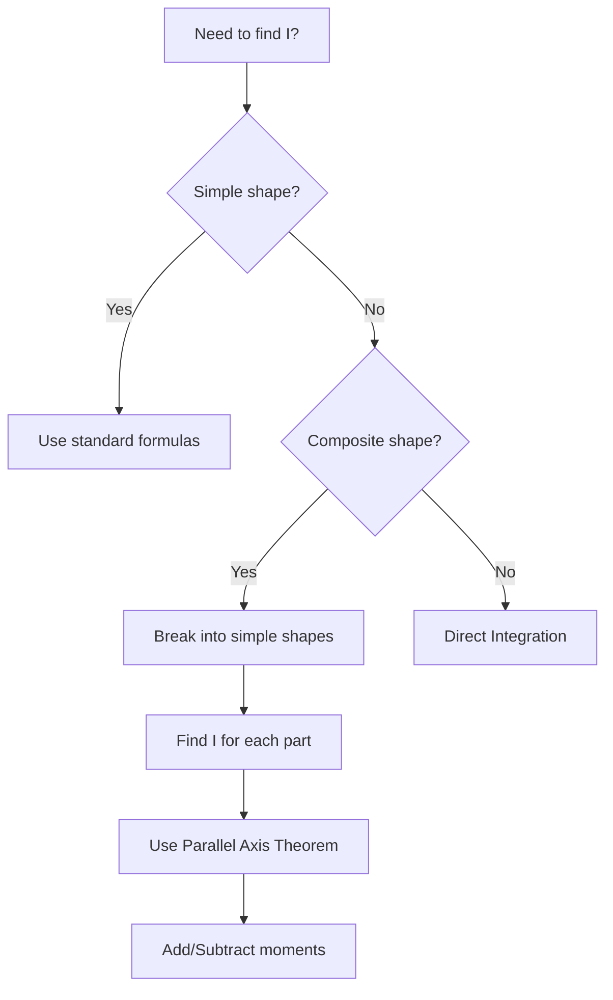

# 📐 Properties of Plane Areas - Complete Guide

---

## 1. Why Are We Doing This? (The Physical Intuition)

> [!question] Think About This
> **Why is a ruler easy to bend when flat, but impossible to bend when held on its edge?**

The material is the same. The cross-sectional area is the same. The difference is **how that area is distributed** relative to the axis of bending.

```
     EASY TO BEND                    HARD TO BEND
    ┌────────────┐                   ┌──┐
    │            │  ←── Force        │  │  ←── Force
    │            │                   │  │
    └────────────┘                   │  │
      Flat ruler                     │  │
     (small depth)                   │  │
                                     │  │
                                     └──┘
                                   On edge
                                 (large depth)
```

> [!important] Engineering Reality
> We define mathematical properties (**Moments of Area**) to quantify this "resistance" depending on the shape's orientation.

---

## 2. The Centroid: The Geometric Center

### Concept

> [!info] Definition
> The centroid $(\bar{x}, \bar{y})$ is the "average" location of all the area in a shape. If the shape were made of a uniform flat plate, the centroid is where you could balance it on the tip of a pencil.

```
           ▲ Y
           │
           │      ┌─────────────┐
           │      │             │
           │      │      ●──────┼── Centroid (x̄, ȳ)
           │      │     C       │
           │      │             │
           │      └─────────────┘
           │
           └──────────────────────► X
```

### The Math (First Moment of Area)

To find the centroid, we calculate the **First Moment of Area** $(Q)$:

$$Q_y = \int_A x \, dA \quad \text{(Moment about Y-axis)}$$

$$Q_x = \int_A y \, dA \quad \text{(Moment about X-axis)}$$

The centroid coordinates:

$$\boxed{\bar{x} = \frac{Q_y}{A} = \frac{\int x \, dA}{\int dA}}$$

$$\boxed{\bar{y} = \frac{Q_x}{A} = \frac{\int y \, dA}{\int dA}}$$

### The "Cheat Code": Symmetry

> [!tip] Symmetry Rule
> If a shape has an **axis of symmetry**, the centroid **must** lie on that line.

```
    RECTANGLE                    CIRCLE                     TRIANGLE
   (2 axes of symmetry)      (infinite axes)            (1 axis if isoceles)
   
    ┌───────────┐                ○○○○○                        ▲
    │     │     │              ○○   ○○                       /│\
    │─────●─────│             ○○  ●  ○○                     / │ \
    │     │     │              ○○   ○○                     /  ●  \
    └───────────┘                ○○○○○                    /   │   \
          ↑                        ↑                     ▼────┴────▼
    Centroid at center      Centroid at center       Centroid at 1/3 height
```

> [!success] Engineering Tip
> Always look for symmetry first. It saves you **50% of the work!**

---

## 3. Second Moment of Area $(I)$: Resistance to Bending

> [!warning] Critical Concept
> This is the **most critical concept** for your future "Mechanics of Solids" classes!

### Concept

This measures **how hard it is to bend a beam**. The further the material is from the "neutral axis" (the axis of bending), the more it resists bending.

### The Math

$$\boxed{I_x = \int_A y^2 \, dA} \quad \boxed{I_y = \int_A x^2 \, dA}$$

### Why $y^2$? (Deep Explanation)

```
                    BENDING A BEAM
                    
        ←─── Compression ───→
        ╔═══════════════════╗  ─┬─
        ║ ← ← ← ← ← ← ← ← ← ║   │  Fibers compress
        ║───────────────────║   │  
        ║   Neutral Axis    ║ ──┼── No stress here
        ║───────────────────║   │
        ║ → → → → → → → → → ║   │  Fibers stretch
        ╚═══════════════════╝  ─┴─
        ←─── Tension ───────→
                 │
                 ▼
            Distance y from 
            neutral axis
```

| Step | What Happens | Mathematical Effect |
|:----:|:-------------|:--------------------|
| 1 | **Stress (σ):** Varies linearly with distance $y$ | Force ∝ $y$ |
| 2 | **Moment Arm:** Multiply force by distance $y$ again | Moment ∝ $y \times y$ |
| 3 | **Result:** | Resistance ∝ $y^2$ |

> [!abstract] Key Insight
> Material **far away** from the center (like the flanges of an I-beam) counts **much more** than material near the center!

```
     INEFFICIENT                      EFFICIENT
    ┌──────────┐                   ┌──────────┐
    │▓▓▓▓▓▓▓▓▓▓│                   │██████████│ ← Far from center (HIGH I)
    │▓▓▓▓▓▓▓▓▓▓│                   │    ││    │
    │▓▓▓▓▓▓▓▓▓▓│                   │    ││    │ ← Near center (low I)
    │▓▓▓▓▓▓▓▓▓▓│                   │    ││    │
    │▓▓▓▓▓▓▓▓▓▓│                   │██████████│ ← Far from center (HIGH I)
    └──────────┘                   └──────────┘
    Solid Rectangle                   I-Beam
    (Material wasted                (Material placed
     near center)                    where it matters!)
```

### Standard Formulas (Memorize These!)

> [!note] Formula Sheet

#### Rectangle (about centroidal axis)

```
         b
    ◄─────────►
    ┌─────────┐  ▲
    │         │  │
    │────●────│  h    Centroidal
    │    C    │  │    X-axis
    │         │  │
    └─────────┘  ▼
```

$$\boxed{I_x = \frac{bh^3}{12}} \quad \boxed{I_y = \frac{hb^3}{12}}$$

> [!tip] Memory Trick
> The dimension that is **cubed** is the one **perpendicular** to the bending axis (the depth). This explains why a ruler on its edge (large $h$) is stiff!

---

#### Triangle (about base)

```
           ▲
          /│\
         / │ \
        /  │  \  h
       /   │   \
      /    │    \
     ▼─────┴─────▼
          ◄─ b ─►
```

$$\boxed{I_{base} = \frac{bh^3}{12}}$$

$$\boxed{I_{centroid} = \frac{bh^3}{36}}$$

---

#### Circle (about diameter)

```
        ○○○○○○○
      ○○       ○○
     ○○    │    ○○
    ○○─────●─────○○  ← Diameter axis
     ○○    │    ○○
      ○○       ○○     r = radius
        ○○○○○○○
```

$$\boxed{I = \frac{\pi r^4}{4} = \frac{\pi d^4}{64}}$$

---

## 4. Polar Moment of Area $(J)$: Resistance to Twisting

### Concept

> [!info] Definition
> If you try to **twist** a shaft (torsion), the resistance depends on how far the material is from the center of rotation (the pole).

```
         TORSION (TWISTING)
         
              ┌─────────┐
             ╱│        ╱│
            ╱ │       ╱ │
           ┌─────────┐  │
           │  │      │  │
           │  ●──────│──┤ ← Twist axis
           │ ╱       │ ╱
           │╱        │╱
           └─────────┘
                ↺ Twisting moment
```

### The Math

$$\boxed{J = I_p = \int_A r^2 \, dA = \int_A (x^2 + y^2) \, dA}$$

### Perpendicular Axis Theorem

> [!success] Theorem
> For plane areas (2D flat shapes), the polar moment equals the sum of orthogonal moments:

$$\boxed{J = I_x + I_y}$$

```
        Y
        ▲
        │     
        │    r
        │   ╱
        │  ╱  
        │ ╱ θ     r² = x² + y²
        │╱        
        ●─────────► X
        
    J = Ix + Iy
```

> [!example] Application
> Used mostly for **circular shafts** in mechanical engineering (e.g., car drive shafts).

---

## 5. The "Power Tools" for Complex Shapes

> [!abstract] Why We Need These
> In engineering, we rarely use simple rectangles. We use **I-beams, T-beams, and L-channels**. To calculate $I$ for these, we need two theorems.

### A. Parallel Axis Theorem ⭐ (The Most Important!)

```
                    │←──── d ────→│
                    │              │
    ────────────────┼──────────────┼──────────── New Axis
                    │              │
                    │   ┌──────┐   │
                    │   │      │   │
    ────────────────│───│──●───│───│──────────── Centroidal Axis
                    │   │  C   │   │
                    │   └──────┘   │
                    │              │
```

$$\boxed{I_{new} = I_{centroid} + A \cdot d^2}$$

Where:
- $I_{centroid}$ = moment of inertia about the centroidal axis
- $A$ = area of the shape
- $d$ = distance between the axes

> [!danger] Crucial Rule
> You **MUST** start from the centroidal axis. You **cannot** jump from one random axis to another directly!


---

### B. Radius of Gyration $(k)$

> [!info] Concept
> "If I squeezed all this area into a thin strip, how far $(k)$ would I have to place it from the axis to get the same $I$?"

```
    ACTUAL SHAPE                    EQUIVALENT
    
    ┌──────────────┐                   
    │              │                   ═══  ← Thin strip
    │      ●       │       ≡           at distance k
    │      C       │                   
    └──────────────┘              ─────●─────
         Area A                        │
                                       k
                                       │
                                   ════════
```

$$\boxed{k = \sqrt{\frac{I}{A}}} \quad \text{or} \quad \boxed{I = A k^2}$$

> [!example] Real Life Application
> Used in **column buckling analysis**. A higher radius of gyration means the column is **less likely to buckle**.

---

## 6. Advanced: Product of Inertia & Principal Axes

### The Problem

> [!question] When Do We Need This?
> When bending force comes at an **angle**, or the shape is **asymmetrical** (like an L-angle bracket).

```
    SYMMETRICAL                    ASYMMETRICAL
    (Ixy = 0)                      (Ixy ≠ 0)
    
    ┌──────────┐                   ┌──────┐
    │          │                   │      │
    │    ●     │                   │      │
    │          │                   │   ●  └──────┐
    └──────────┘                   │             │
                                   └─────────────┘
     Bends straight                 Twists when bent!
```

### Product of Inertia $(I_{xy})$

$$\boxed{I_{xy} = \int_A xy \, dA}$$

| Condition | Result |
|:----------|:-------|
| Shape has **any axis of symmetry** | $I_{xy} = 0$ |
| Shape is asymmetrical | $I_{xy} \neq 0$ → Shape **twists** when bent |

### Principal Axes

> [!success] Definition
> For any shape, there exists a specific angle $\theta$ where $I_{xy}$ becomes **zero**.

```
         Y                              V (Principal)
         ▲                              ▲
         │                             ╱
         │   L-Shape                  ╱  L-Shape
    ┌────┤                      ┌────┤
    │    │                      │    │ ╲
    │    └────►X           ────►│    └──╲───► U (Principal)
    │         │                 │        ╲
    └─────────┘                 └─────────╲
    
    Regular axes:                Principal axes:
    Ixy ≠ 0                      Ixy = 0
                                 I = Imax or Imin
```

$$\boxed{\tan 2\theta = \frac{-2I_{xy}}{I_x - I_y}}$$

$$\boxed{I_{max/min} = \frac{I_x + I_y}{2} \pm \sqrt{\left(\frac{I_x - I_y}{2}\right)^2 + I_{xy}^2}}$$

> [!warning] Engineering Application
> When designing an L-bracket, you **must** calculate Principal Moments of Inertia to find the **weakest axis** — that's where it will **fail first**!

---

## 7. Applied Practice: Worked Examples

### Context: L-Shaped Section

```
    100mm
    ◄────►
    ┌────┐───▲
    │    │   │
    │ ●C │   │
    │    │   │ 100mm
    └────┼───┤
         │   │
    ─────┴───┴─── 15mm thick
         15mm
         
    Area A = 2775 mm²
    Centroid at C(28.4, 28.4)
    I₁ = 101 × 10⁴ mm⁴ (Principal max)
    I₂ = 17.8 × 10⁴ mm⁴ (Principal min)
```

### Question 3: Parallel Axis Theorem

> [!example] Problem
> Find $I$ about axis parallel to $I_2$ passing through corner point.

**Solution using Parallel Axis Theorem:**

$$I_{new} = I_{centroid} + A \cdot d^2$$

$$I_{new} = 17.8 \times 10^4 + 2775 \times (28.4)^2$$

$$I_{new} = 17.8 \times 10^4 + 223.7 \times 10^4$$

$$\boxed{I_{new} \approx 414 \times 10^4 \text{ mm}^4}$$

---

### Question 4: Using Perpendicular Axis Theorem

> [!example] Problem
> Find $I_{xx}$ and $I_{yy}$ for equal angle section.

**Solution:**

Since $I_1 + I_2 = I_x + I_y$ (invariant sum):

$$I_1 + I_2 = 101 + 17.8 = 118.8 \times 10^4 \text{ mm}^4$$

For **equal angle** section: $I_x = I_y$ (by symmetry)

$$2I_x = 118.8 \times 10^4$$

$$\boxed{I_x = I_y = 59.0 \times 10^4 \text{ mm}^4}$$

---

### Question 5: Polar Moment at Corner

> [!example] Problem
> Find polar moment about corner point A.

**Solution:**

Step 1: Polar moment at centroid
$$J_C = I_1 + I_2 = 118.8 \times 10^4 \text{ mm}^4$$

Step 2: Distance from C to A
$$r^2 = (28.4)^2 + (28.4)^2 = 1612.72 \text{ mm}^2$$

Step 3: Transfer to point A
$$J_A = J_C + A \cdot r^2$$
$$J_A = 118.8 \times 10^4 + 2775 \times 1612.72$$

$$\boxed{J_A \approx 223 \times 10^4 \text{ mm}^4}$$

---

## 8. Quick Reference Summary

> [!abstract] Formula Cheat Sheet

| Property | Formula | Use |
|:---------|:--------|:----|
| **Centroid** | $\bar{x} = \frac{\int x\,dA}{A}$ | Finding balance point |
| **Second Moment** | $I_x = \int y^2\,dA$ | Bending resistance |
| **Polar Moment** | $J = I_x + I_y$ | Torsion resistance |
| **Parallel Axis** | $I = I_c + Ad^2$ | Transfer between axes |
| **Radius of Gyration** | $k = \sqrt{I/A}$ | Buckling analysis |

### Decision Flowchart



---

## 9. Practice Challenge

> [!question] Try This!
> Derive the moment of inertia for a **hollow rectangular tube**:

```
    ┌─────────────────┐
    │  ┌───────────┐  │
    │  │           │  │
    │  │   HOLLOW  │  │
    │  │           │  │
    │  └───────────┘  │
    └─────────────────┘
```

> [!tip] Hint
> $$I_{hollow} = I_{outer} - I_{inner}$$
> 
> $$I = \frac{BH^3}{12} - \frac{bh^3}{12}$$

---

#mechanics #engineering #momentofinertia #centroids #beams# teatttt
